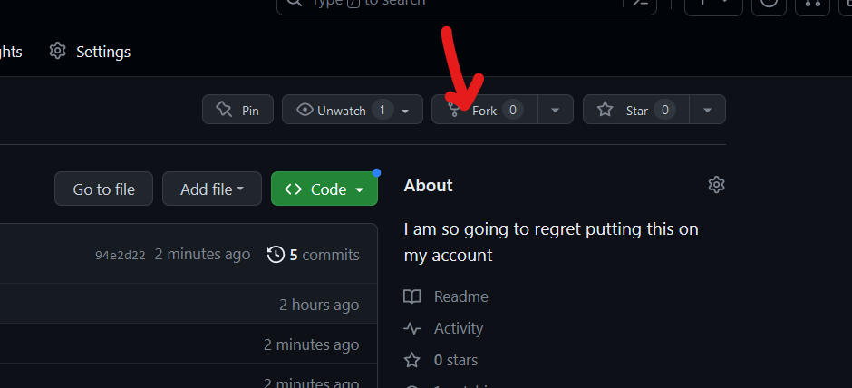

## How are fics grouped?​

Fics are grouped by Year then Chapter. So for adding fic via the folder you will have to go via blog --> year --> chapter


## Fic file naming.​

The file name should be chapter-X.md X being the chapter number eg one, two, four etc EG. chapter-one.md
How to add fics?​

## First fork the webpage:


Ensure that the owner is your user. Alt text


Be Sure to Check this first:​

![Alt text] (https://cdn.discordapp.com/attachments/1148404965358977044/1148443358277140551/image.png "a title")

If on your fork it says that it is "behind by X commits" click the sync fork.

Next on your fork: Go to blogs --> year0 then hit add file --> create new file.

Then paste this template in:
```
---
slug: chapter-one-TITLE
title: "Year 0 Chapter X: TITLE"
authors:
  name: username
  title: title/rank
  url: https://github.com/<YOURGITHUB USERNAME>
  image_url: <image url>
tags: [year0, Snek, SFW, Pov, USA]
date: YYYY-MM-DD
---


<fic text here>
```
Most of these are self explanitory. The authors section should be who wrote the fic. Tags are up to you but they should follow the format of 
[year, Chars, SFW/NSFW, Pov/3rdperson, Locations, subtags] 

Examples would include
```
[year1, Snek, Tzar, NSFW, Mix-Pov, USA, their-house, country-side]
[year50, Jacko, EE, NSFW, Mix-Pov, USA, EE-parents-house, country-side, fetish, gag]
```
Do not tag like this: [year50, Jacko, EE, NSFW, Mix-Pov, USA, EE-PRAENTS-House, countrySide] if its multiple words use a dash

Want to add images?​

use this format if the image does not belong to you
```

Image belongs to their original authors. Source: <URL/WEBPAGE>
```
Or use this format if the image belongs to you
```

```
## How to get it published?​

After you hit commit changes you will need to make a pull request. Hit the code button at the top left to reuturn to your forks homepage. You will see a message that says something like This branch is 1 commit ahead of XXXXX and on the right of that it says contribute. Hit that button then hit open pull request


When you're going to make a pull request. Ensure your title is descriptivve. I do not want to see Create test.md or Updated test.md should be like Added chapter X and Y in year B Also write some comments under the "Leave a Comment" section to allow me to review your work faster.


## Want to write for another year/timespam?​


Place your cursor in the "year0" box and then press backspace.

Your cursor should now be inside the "year0" box.


Once your cursor is in the box, you can change "year0" to the desired year, for example, "year45."


Next, press "/".


Once it looks like this, you can create the first chapter for that year. Don't forget to follow the naming conventions!
